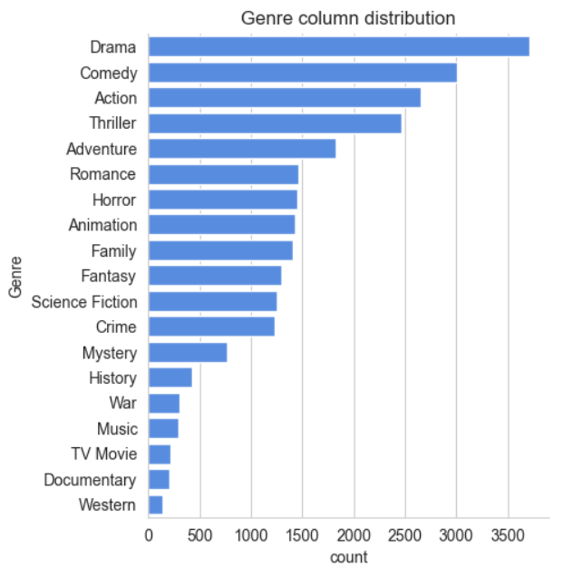
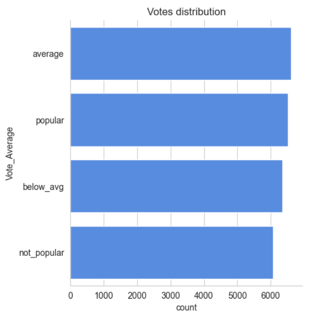
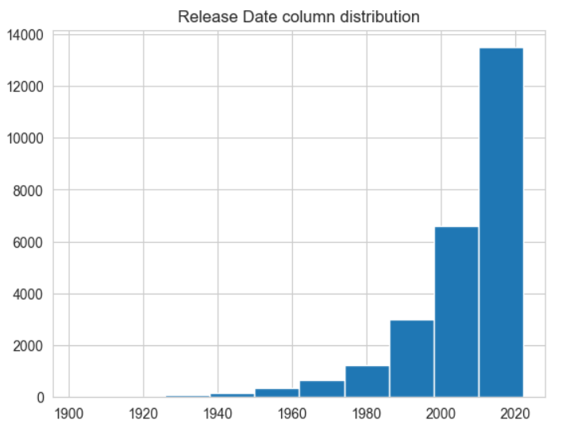

# 🎬 Netflix Movie Data Analysis

## 📖 Overview

This project focuses on analyzing a Netflix movie dataset to uncover trends and insights using Python and Jupyter Notebook. The goal is to answer key questions such as which genres are most frequent, how popularity and ratings are distributed, and how movie releases have evolved over time.

By preprocessing the data, cleaning it, and visualizing it effectively, we aim to gain a better understanding of Netflix's movie catalog and its characteristics.

---

## ❓ Key Questions Explored

1. What is the most frequent genre of movies released on Netflix?
2. Which category has the highest number of popular movies (Vote_Average)?
3. What movie got the highest popularity? What’s its genre?
4. What movie got the lowest popularity? What’s its genre?
5. Which year has the most movies filmed?

---

## 🛠️ Tools and Technologies Used

- **Python** 🐍
  - `pandas` – for data cleaning & manipulation
  - `numpy` – for numerical operations
  - `matplotlib` & `seaborn` – for data visualization
- **Jupyter Notebook** – for interactive analysis and plotting

---

## 🔍 Preprocessing & Exploration

- The dataset originally contained **9827 rows and 9 columns**.
- **Dropped irrelevant columns**: `Overview`, `Original_Language`, and `Poster_Url` were not necessary for analysis.
- **Extracted year from `Release_Date`**: Converted full release dates to year only for yearly trends.
- **Created `Vote_Average` bins**:
  - **not_popular** (0–2.5)
  - **below_avg** (2.5–5)
  - **average** (5–7.5)
  - **popular** (7.5–10)
- **Genres** were separated and exploded so each row had only one genre.
- Cleaned and converted genres into a **categorical variable** for better performance.

---

## 📊 Analysis & Detailed Results

### Q1: What is the most frequent genre of movies released on Netflix?

**Answer:**  
🎭 **Drama** is by far the most frequent genre in the dataset. It accounts for **14% or more** of the total genres, significantly ahead of others like Comedy, Thriller, and Action.

This suggests that Netflix's library leans heavily into serious, story-driven films. The dominance of Drama may also reflect global cinematic trends and Netflix’s focus on strong narratives.

> _Include a genre distribution bar plot here_  
> 

---

### Q2: Which category has the highest number of popular movies (Vote_Average)?

**Answer:**  
📈 Using the defined bins for `Vote_Average`, we found that approximately **25.5%** of the movies fall under the **"popular"** category (i.e., they have a vote average of more than 7.5).

Among these popular movies, **Drama again dominates**, with over **18.5%** of the "popular" votes, followed by genres like Comedy and Action. This means that not only is Drama frequent, it also tends to be well-received by audiences.

> _Include a bar chart of vote category by genre_  
> 

---

### Q3: What movie got the highest popularity? What’s its genre?

**Answer:**  
🕷️ The movie with the **highest popularity score** in the dataset is:

- 🎬 **Spider-Man: No Way Home**  
- 💥 **Popularity Score**: **5083.954**  
- 📂 **Genres**: Action, Adventure, Science Fiction

This makes sense given the movie's global box office performance, critical acclaim, and its Marvel Cinematic Universe (MCU) context. Its popularity score is far above the second-highest, making it a clear standout.

---

### Q4: What movie got the lowest popularity? What’s its genre?

**Answer:**  
📉 The movie with the **lowest popularity score** is:

- 🎬 **The United States, Thread**  
- 📂 **Genres**: Music, Drama, War, Sci-Fi, History

This film is likely a lesser-known, possibly niche or indie film. The combination of genres suggests it attempts to cover complex and possibly abstract themes. Its very low popularity could result from limited audience reach, minimal promotion, or low engagement.

---

### Q5: Which year has the most movies filmed?

**Answer:**  
📆 The year with the **most movies released** is **2020**.

Despite the global pandemic, 2020 saw a surge in streaming content, especially on platforms like Netflix. With traditional cinemas closed in many regions, Netflix increased its original movie output, which is likely why this year shows a spike in production.

> _Include a line or bar plot of number of films by year_  
> 

---

## 🚧 Challenges Faced

- **Genre explosion**: Each movie had multiple genres, requiring transformation using the `explode()` function to analyze them individually.
- **Categorizing Vote_Average**: Binning the vote average scores into four meaningful categories required experimentation and adjustment.
- **Data noise**: Some movies had unclear or inconsistent information, which needed handling to prevent skewed results.
- **Visualization clarity**: Designing charts that were both readable and insightful took multiple iterations.

---

## ✅ Conclusion

This project successfully demonstrates how we can extract meaningful insights from a real-world dataset using Python, data preprocessing, and visualization.

### Key Takeaways:
- **Drama** is the most frequent and well-received genre on Netflix.
- **2020** had the most movie releases, likely due to a shift to digital streaming.
- **Spider-Man: No Way Home** stands out as the most popular movie, and
- Lesser-known titles have significantly lower visibility and popularity.

This analysis can help stakeholders (like streaming platforms or filmmakers) understand trends and align their strategies accordingly.

---

